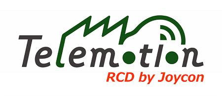

## 概要

完成車両をJOYCONで遠隔操作するためのソフトウェア

## 運用

各人が**自分の名前のbranch名でリモートに上げて**、
実車評価時に代表者が全branchのコードをダウンロードして動作確認を実施する

## 手順
※1：ローカルへのダウンロード＆リモートへのアップ<br>
※2：必要なアプリケーションは下記


 - [git](https://git-scm.com/downloads)（クラウドにプログラムをアップロードするため）
 - [VisualStudioCode](https://code.visualstudio.com/Download)（上記gitをわかりやすく操作するため＆プログラム編集のため）

#### ダウンロード
① VSCodeのターミナルを起動

② ダウンロードしたいフォルダに移動
```
cd <ダウンロードしたいフォルダのリンク>
```
② リモートのリポジトリをダウンロード
```
git clone https://github.com/Yasuyoshi1118/RemoteControlbyJoycon.git
```
③ ブランチを自分の名前に変更
```
git switch -c <自分の名前>
```
 ③ 自分のブランチでプログラムを編集

<br>

#### アップロード
 ① 変更したファイルをステージング上に移行
 ```
 git add <変更してアップしたいファイル>
 ```
 ② 変更したファイルを登録
 ```
 git commit -m "<登録コメントを記載>"
 ```
 ③ リモートに自分のファイルをアップロード
 ```
 git push origin <自分の名前のbranch名>"
 ```
